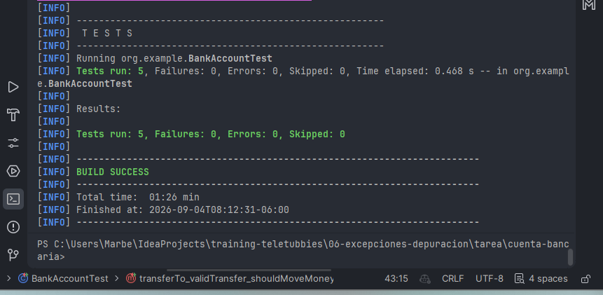

Descripción:
Se corrigieron los defectos encontrados en la clase BankAccount y se agregaron pruebas unitarias para validar los comportamientos esperados.
Cambios realizados
Se agregó validación en deposit() para rechazar cantidades menores o iguales a 0.
Se agregó validación en withdraw() para rechazar cantidades menores o iguales a 0.
Se agregó la validación de fondos suficientes en withdraw().
Se creó InsufficientFundsException como excepción personalizada para los retiros que superan el saldo disponible.
Se mejoró el mensaje de la excepción para incluir el monto solicitado y el saldo disponible.
Se agregó validación para evitar transferencias hacia una cuenta null.
Se modificó transferTo() para reutilizar withdraw() y deposit(), evitando modificar directamente balance y duplicar la lógica de validación.
Se agregaron pruebas unitarias para cubrir los casos de depósito, retiro y transferencia.
Se reemplazaron las comparaciones assertEquals por AssertJ mediante assertThat e isCloseTo, manteniendo la tolerancia de 1e-9 para valores double.
para correr las pruebas: `mvn test` y todas pasaron correctamente.
