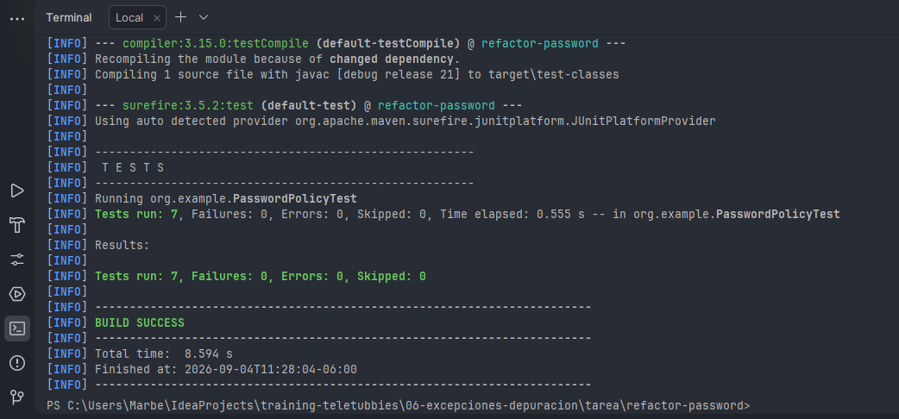

## Refactorización de PasswordPolicy

- Se reemplazó el número 8 por la constante `MIN_LENGTH`.
- Se agregó una validación explícita para contraseñas `null`.
- Se eliminaron los `if` anidados utilizando retornos tempranos.
- Se separó la lógica en métodos pequeños con nombres claros.
- Se eliminaron los bucles duplicados y se consolidó la lógica de verificación de dígitos y mayúsculas en un solo método.
- para correr las pruebas: `mvn test` y todas pasaron correctamente.
- 